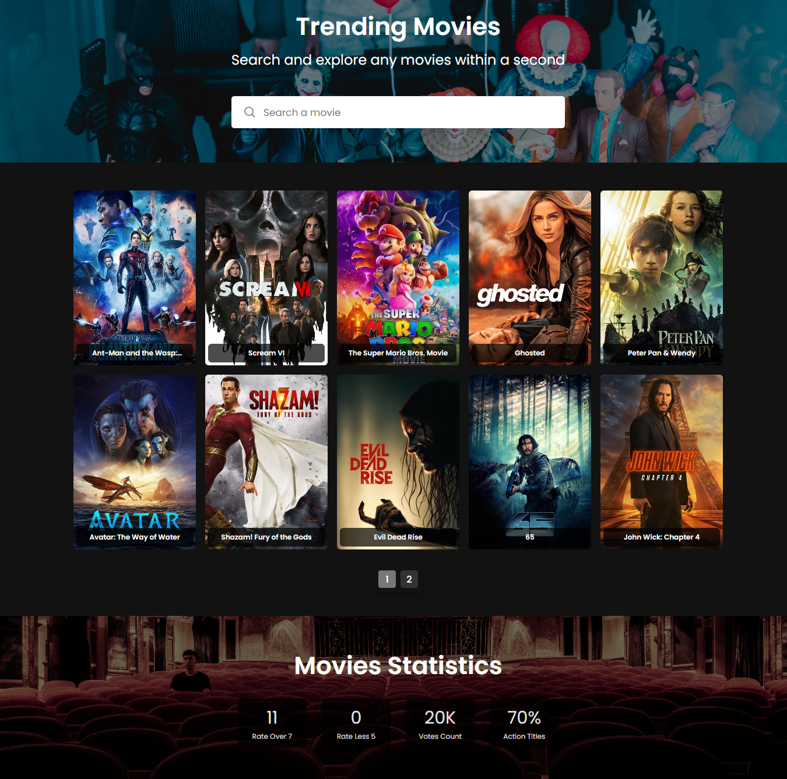

# Movie Search App

This is a simple Vue.js application that allows users to search and filter a list of movies using The Movie Database API. It displays a list of popular movies and allows users to search for a movie by title. Below the list of movies, there is a statistics section that shows the number of titles with vote_average over 7, the number of titles with vote_average less than 5, the total votes count of all movies in the list, and the percent of Action titles of all titles in the list.

## Preview



## Getting Started

### Prerequisites

- The Movie Database API key (you can obtain it [here](https://www.themoviedb.org/settings/api))

### Installation

1. Clone the repository:

   ```sh
   git clone https://github.com/hosammousa/movie-search-app.git
   ```

2. Navigate to the project directory:

   ```sh
   cd movie-search-app
   ```

3. Install the dependencies:

   ```sh
   npm install
   ```

### Usage

1. Start the development server:

   ```sh
   npm run serve
   ```

2. Open your browser and go to `http://localhost:8080`.

### Built With

- [Vue.js](https://vuejs.org/guide/introduction.html)
- [Axios](https://axios-http.com/)
- [The Movie Database API](https://developers.themoviedb.org/3/getting-started/introduction)
- [SweetAlert2](https://sweetalert2.github.io/)
- [HTML]
- [CSS]
- [Google Fonts](https://fonts.googleapis.com/css2?family=Poppins:wght@400;500;600&display=swap)

### Contact

Hosam Mousa - [hosam.r.mousa@gmail.com](mailto:hosam.r.mousa@gmail.com)

Project Link: [https://github.com/hosammousa/movie-search-app](https://github.com/hosammousa/movie-search-app)
